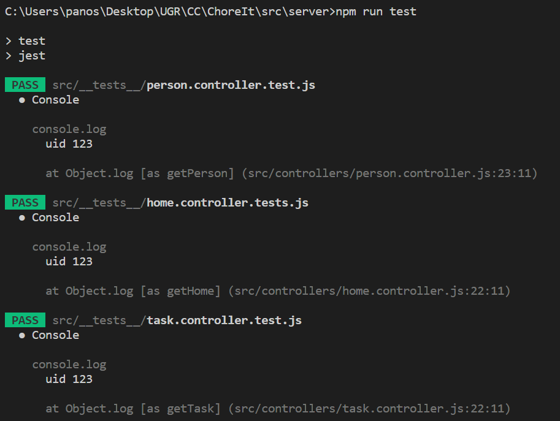

# Hito 2 - Testing

El objetivo de este hito es desarrollar un conjunto de pruebas que nos permita, de forma automática, comprobar que la funcionalidad esperada de nuestra app es correcta.

Al tener desarrollada ya la API, que se añadirá en hitos posteriores, y sabiendo que esta es una de las partes más importantes del proyecto, he decidido centrar las pruebas en testear las distintas funcionalidades de la API.

Para ello, se ha creado la carpeta [\_\_tests\_\_](https://github.com/panosjuanis/ChoreIt/tree/main/src/server/src/__tests__), donde se pueden encontrar tres archivos de tests:

* home.controller.tests.js
* task.controller.tests.js
* person.controller.tests.js

Cada fichero contiene distintas pruebas lanzadas contra el controlador del modelo correspondiente.

Como framework de testing se ha escogido Jest, ya que tras mirar alguna guía parecía bastante sencillo de utilizar, y tras haber desarrollado las pruebas, se han encontrado pocos problemas y ha sido bastante sencillo de implementar.

Como gestor de paquetes se ha utilizado node package manager (npm), gestor que se utilizaba desde el inicio del proyecto y muy común en el stack con el que se trabaja.

Para lanzar las pruebas sencillamente debemos ejecutar el comando **npm run test**, que ejecutará un script definido en nuestro package.json 

Una vez ejecutado obtendremos el siguiente output:

