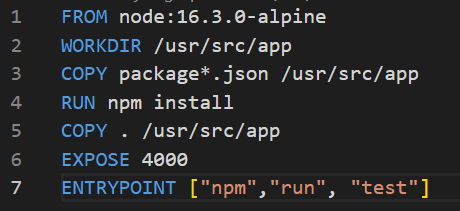

# Hito 3 - Creación de un contenedor para pruebas

El objetivo de este hito ha sido la creación de un contenedor para desplegar las pruebas desarrolladas en el hito anterior, utilizando la tecnología Docker.

De esta forma se consigue aislar la ejecución de la aplicación y se facilita su despliegue.

Con el fin de asegurar que la creación del entorno de pruebas es reproducible diseñaremos y utilizaremos un Dockerfile, que permitirá construir una imágen para desplegar los procesos deseados, en nuestro caso los tests contra la API de ChoreIt explicados en el anterior hito.

## Creación del Dockerfile

Para la creación del Dockerfile, me he basado en la [guía provista por Node](https://nodejs.org/en/docs/guides/nodejs-docker-webapp/), ya que ha simplificado mucho el proceso y garantiza utilizar las mejores herramientas, ya que son las sugeridas por los propios desarrolladores de Node.js.

Veamos el código final:

Se ha escogido la versión alpine de la imagen Node ya que es algo más ligera que la completa.

Copiamos las dependencias ubicadas en el package.json para instalar correctamente todas las dependencias necesarias y las instalamos utilizando el comando **RUN npm install**.

Por último exponemos el puerto 4000 del Docker y como entry point lanzamos el comandp **npm run test**, que ejecutará los test deseados.

Una vez creado nuestro Dockerfile, ejecutamos los siguientes comandos:

* docker build -> sobre nuestro proyecto para construir la imagen del contenedor.
* docker images -> para ver las imagenes disponibles 

* docker run -p 4000:4000 -d panos/choreiot-test

También podemos ejecutar el docker desde la GUI de Docker Desktop:

Donde podremos ver el output de la ejecución del docker:

Este hito ha servido para conocer el funcionamiento y la gran utilidad y versatilidad que nos aportan los dockers, y en la medida de lo posible intentaré utilizarlos en el futuro ya que son una forma muy cómoda de desplegar aplicaciones.

