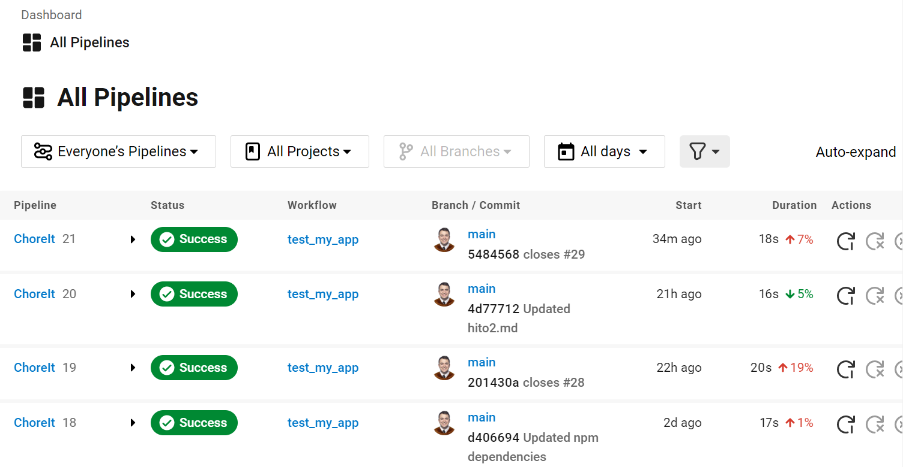

# Hito 4 - Integración Continua

Una buena práctica en el desarrollo de software es asegurar la validez del código tras aplicar cambios, ya que es un momento crítico para detectar fallod, para ello se suelen implementar sistemas de testeo automáticos que ejecuten una serie de pruebas al detectar un cambio en el código para verificar que nada se ha "roto".

El objetivo de este hito es implementar un sistema de integración continua (CI) para el código desarrollado anteriormente.

Existen múltiples herramientas que podrían utilzarse, como GitHub Actions, Shippable o Travis, pero finalmente yo me he decantado por Circleci ya que otros compañeros también lo habían utilizado con facilidad.

## Config.yml

El archivo de configuración utilizado para lanzar los tests mediante circlecli se llama **config.yml**, y se ubica dentro del directorio ./circleci en el repo de github, de esta forma el servidor de circcleci es capaz de encontrarlo al detectar commits al código.

En el archivo de configuración vemos que lo configuramos para utilizar una versión de node provista por circleci, como imagen docker utilizamos la versión estándar de node.

Los últimos pasos son instalar las dependencias utilizando npm y ejecutar los scripts de test definidos, los resultados los podemos consultar en la web del circleci, donde hemos tenido que vincular el repositorio de gh:

Aquí podemos ver todos los "jobs" lanzados al realizar cada cambio al repositorio, y ver si han tenido un resultado exitoso o fallido y los motivos.

Al inspeccionar más detalladamente un job concreto podemos ver:

Como vemos, encontramos los siguientes pasos:

* Spin up environment -> Ejecuta la imagen de docker descrita en config.yml
* Preparing environment variables -> Prepara las variables de entorno
* Checkout code -> Recibe el código de gh
* Install dependencies -> Instala las dependencias descritas en config.yml
* test -> Ejecuta los jobs definidos en config.yml, en nuestro caso ejecutar los test, que funcionan correctamente.

Esta práctica ha sido muy útil para conocer los diversos sistemas de integración continua que existen, así como los beneficios que implementar un sistema de éste tipo aporta. Con una pequeña inversión de tiempo y esfuerzo, podemos asegurar una mayor calidad del código desarrollado y principalmente, detectar errores rápidamente, con lo que ahorramos muchos quebraderos de cabeza y tiempo perdido.
