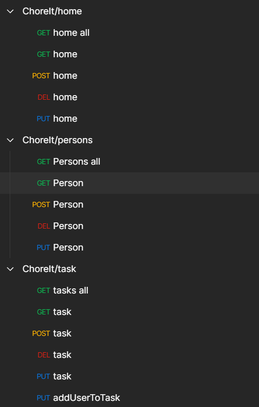

# Hito 5 - Diseño y test de un microservicio

En este hito trataremos de diseñar e implementar una API que permita cumplir las historias de usuario propuestas en en hito 0. Posteriormente se desplegará como servicio web y se testeará mediante las pruebas diseñadas en el hito 3.

## API

La API de ChoreIt se divide principalmente en operaciiones CRUD sobre los modelos implementados, la estructura de las llamadas tiene la siguiente forma:

* VERBOHTTP http://ip:puerto/api/modelo/{id}, por ejemplo:
* GET http://localhost:4000/api/person/63d2b7d7d7bcd63911a55b50

Veamos la estructura de la API:

Como se puede ver, las llamadas están segmentadas por los modelos, y casi todas se corresponden a operaciones CRUD, siendo la última llamada, **addUserToTask** la única que implica una cierta lógica de negocio, en el futuro se deberían implementar otras operaciones, que permitan ejecutar otra lógica de negocio sólamente con llamadas a la API.

Los datos y enviados en las llamadas tienen formato JSON, por ejemplo una llamada GET nos devolvería:

Esta api se puede empaquetar y desplegar como microservicio y ser testeado por los scripts de test definidos en el hito 3 y añadidos a la integración continua en el hito 4.

En el futuro quedaría añadir más lógica de negocio accesible mediante llamadas http, así como desplegar la api en un docker como microservicio.